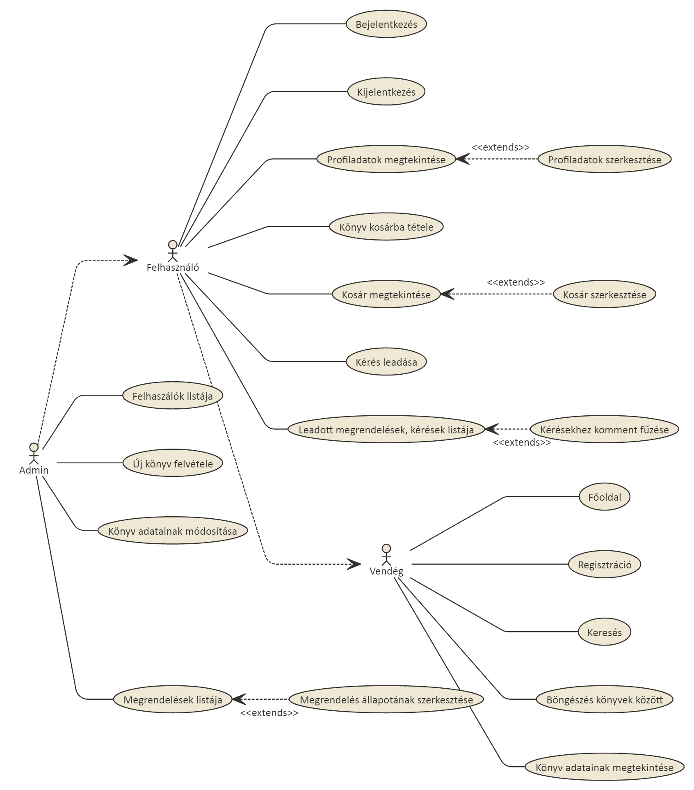
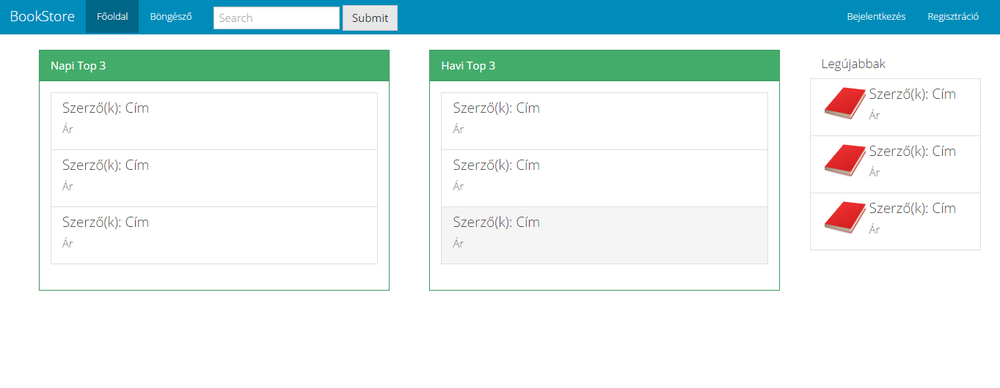
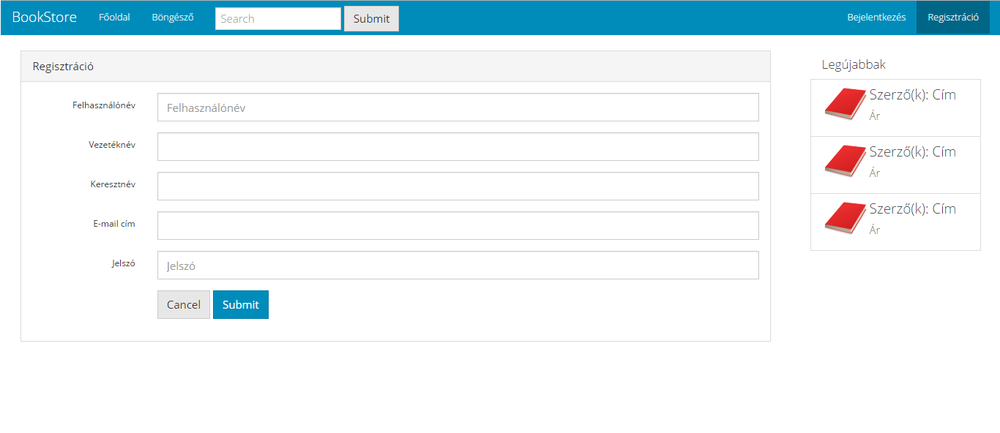
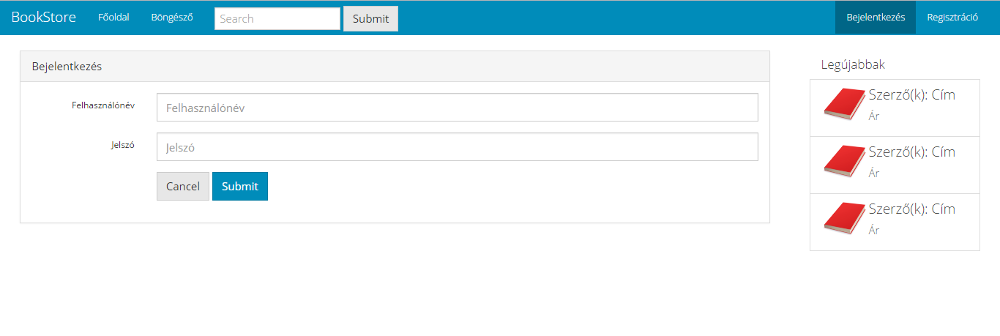
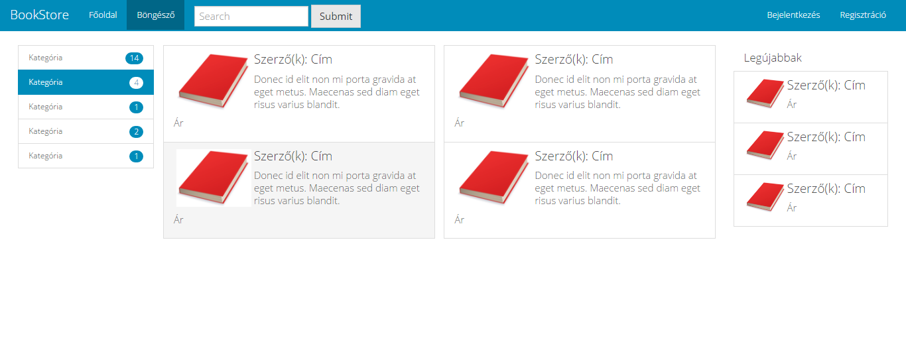
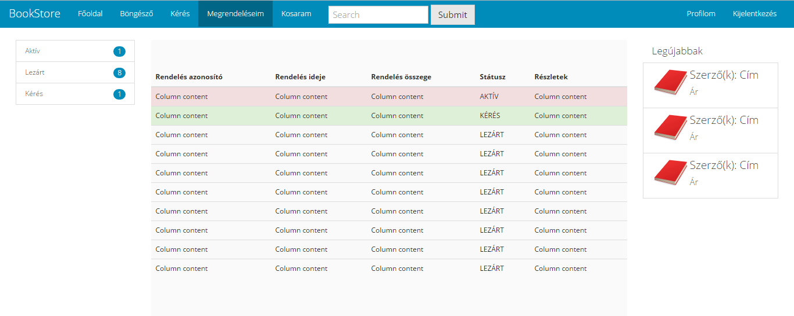
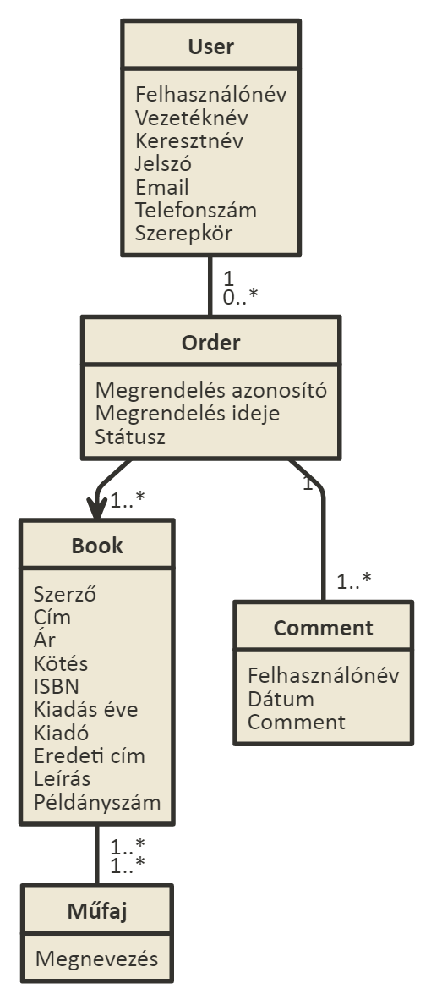
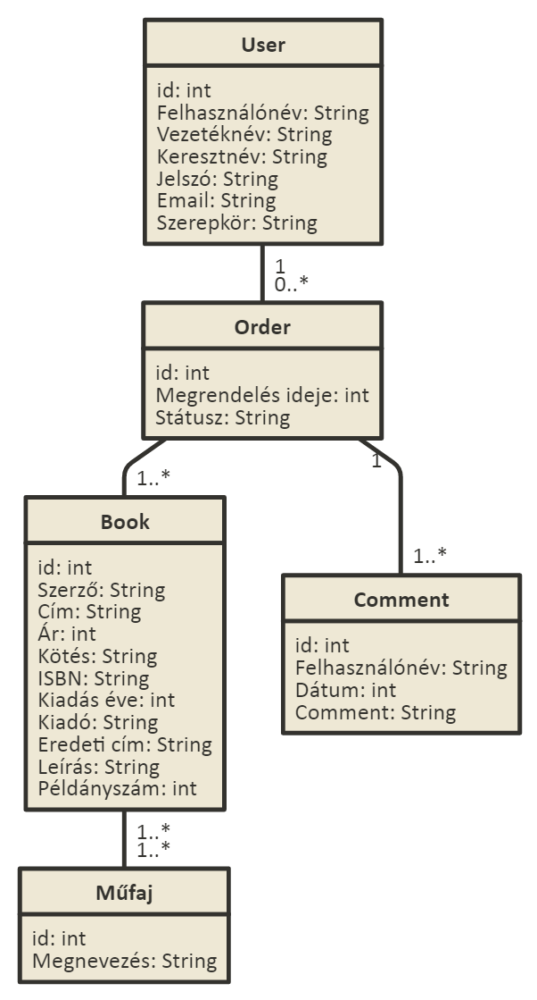
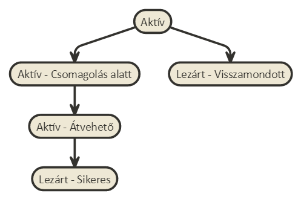
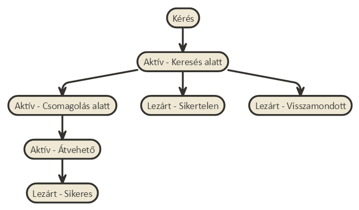

# bookStore
##1. Követelményanalízis

- Követelmények összegyűjtése

  - Funkcionális elvárások:
  
    + Vendégként szeretnék tudni regisztrálni.
    + Vendégként szeretnék az elérhető könyvek között böngészni.
    + Vendégként szeretném az elérhető könyvek adatait megnézni.
    + Vendégként elérhető könyvet között szeretnék tudni keresni.
    + Vendégként szeretném a legjobban keresett könyvek listáját megtekinteni a főoldalon.
    + Felhasználóként szeretnék tudni bejelentkezni.
    + Felhasználóként szeretnék tudni kijelentkezni.
    + Felhasználóként szeretném tudni szerkeszteni a saját profilomat.
    + Felhasználóként szeretnék tudni könyvet a kosárba tenni, kosárból kivenni.
    + Felhasználóként szeretnék tudni könyvre kérést leadni (raktárról el nem érhető, idegen nyelvű, meghatározott kiadású stb)
    + Felhasználóként szeretném a megrendeléseim, kéréseim listáját megtekinteni, 
    + Felhasználóként szeretnék tudni az aktív kérésekhez kommentet fűzni
    + Adminként szeretném a felhasználók listáját megtekinteni, módosítani
    + Adminként szeretném az aktuális megrendelések, kérések listáját megtekinteni, azok szerkeszteni
    + Adminként szeretnék tudni új könyvet felvenni, meglévő könyvek adatait módosítani, könyvet törölni
    + Adminként szeretnék tudni új műfajt felvenni, meglévőket törölni
    
  - Nem funkcionális követelmények
  
    + Felhasználóbarát, ergonomikus elrendezés és kinézet
    + Gyors működés
    + Biztonságos működés: jelszavak tárolása, funkciókhoz való hozzáférés
    
- Szakterületi fogalomjegyzék

  - Könyv: Olyan, szövegből és ábrából álló, fizikai (papír) információhordozójú, nem periodikus (irodalmi vagy szakmai célú) publikáció, amely 49 vagy több oldalból áll, terjedelmi szempontból a borítót nem számítva. 
  A könyv nyomdaipari sokszorosítással előállított tömegtermék.
  
  - Műfajok
    + Disztópia: A disztópia egy társadalom víziója, mely ellentétes az utópiával. Gyakran negatív jövőképet mutat. A disztopikus társadalmakban gyakran az életkörülmények nyomorúságosak, a szenvedés, a szegénység, az elnyomás, az erőszak, járványok és szennyeződések jellemzik.
    + Fantasy: A Fantasy fő jellemzője, hogy a tartalma többnyire olyan elképzelt, mitikus jellegű, valamilyen tekintetben mindig irreális, az író által teremtett, csak annak fantáziájában létező alternatív világokba, mint keretbe van ágyazva, mely felépítésében, fizikai és etikai törvényeiben, értékeiben, élőlényeiben, rokonságot mutat a vallások és mítoszok által megteremtett képzeletbeli világokkal.
    + Horror: A horror olyan irodalmi műfaj, amelynek középpontjában a félelem áll. Habár alapvetően irodalmi művekről van szó, megjelenhet más ágazatokban is, melyek közül a legtipikusabb a film.
    + Krimi: A krimi vagy bűnügyi regény az epika (elbeszélő irodalom) egy népszerű tematikus műfaja, amely a bűntények felderítésével, elkövetésük bemutatásával, illetve lélektani indítóokaik vizsgálatával, valamint a bűnözők, nyomozók („detektívek”) és bűnügyi rendőrök világával foglalkozik.
    + Posztapokaliptikus: Egy látomásszerű világkép, melyben egy világméretű katasztrófa zajlott le és emiatt a világ megváltozott. Ez a katasztrófa utáni állapot legtöbbször negatív, baljós és sivár.
    + Romantikus: Olyan alkotások, amelyekben a felfokozott életérzés kifejezése, a reményvesztettség, a csalódás, a világfájdalom vagy éppen az ezzel ellentétes forradalmi hevület és lángoló életöröm van jelen.
    + Sci-fi: A sci-fi az angol science fiction kifejezés. Jelentése: tudományos-fantasztikus. A tudományos-fantasztikus mű olyan irodalmi alkotás, mely legtöbbször valódi vagy képzeletbeli tudományoknak a társadalomra, vagy egyes egyénekre gyakorolt hatását mutatja be. Ezeknek a műveknek a közös jellemzői, hogy zömében egy lehetséges jövőben játszódó képzeletbeli történetek.
    + Urban Fantasy: Hasonlít a történelmi fantasyhoz, de mai korban játszódik, ahol a mágia és/vagy a mitikus lények többé-kevésbé titokban jelen vannak.
	

- Használatieset-modell

  - Szerepkörök
    + Vendég: Raktáron lévő könyvek között böngészhet, megtekintheti azok adatait.
    + Felhasználó: A vendég szerepkörön túl könyveket kosárba helyezhet, megrendelést adhat le, raktárról nem elérhető, különleges könyvek felkutatására adhat le igényt, ezzel kapcsolatban a munkatársak megjegyzéseit megtekintheti, válaszolhat rájuk, saját megrendeléseit kilistázhatja.
    + Admin: A felhasználó szerepkörén túl új raktáron lévő könyvet vehet fel, a könyvek adatait módosíthatja, törölheti a raktáron lévő könyveket. Felhasználók, megrendelések listáját megtekintheti módosíthatja azokat. Megrendelésekhez kommentet fűzhet, állapotukat átállíthatja. Új műfajt vehet fel, meglévőt törölhet.
			
  - Használati esetek
    	
  - Folyamatok
  	+ felhasználó:
		- Bejelentkezés folyamata
			
		- Rendelés folyamata
			

##2. Tervezés

- Architektúra terv

	- Oldaltérkép
    
		- Publikus:
			- Főoldal
			- Könyvek böngészése
				+ Könyv adatainak megtekintése
			- Belépés
			- Regisztráció
		- Felhasználó:
			- Kilépés
			- Profiladatok
				+ Profiladatok szerkesztése
			- Kérés felvitele
			- Könyvek böngészése
				+ Könyv adatainak megtekintése
					+ Könyv kosárba tétele
			- Kosár tartalmának listája
				+ Kosár tartalmának módosítása
				+ Megrendelés feladása
		- Admin:
			- Felhasználók listája
				+ Felhasználók szerkesztése
			- Megrendelések/kérések listája
				+ Megrendelés/kérés adatainak megtekintése
					+ Státusz módosítása
					+ Komment fűzése
			- Könyvek böngészése
				+ Új könyv felvétele
				+ Könyv adatainak megtekintése
					+ Könyv adatainak szerkesztése
					+ Könyv törlése
	- Végpontok
		- GET /: főoldal
		- GET /login: bejelentkező oldal
		- POST /login: bejelentkezési adatok felküldése
		- GET /signup: regisztrációs oldal
		- POST /signup: regisztrációs adatok felküldése
		- GET /profile: profiladatok
		- GET /profile/edit: profiladatok szerkesztése, ürlap megjelenítése
		- POST /profile/edit: profiladatok szerkesztése, adatok küldése
		- GET /books: könyvlista
		- GET /books/:id : könyv megtekintése
		- POST /books/:id : könyv kosárba helyezése
		- GET /mybasket: kosár tartalma
		- POST /mybasket/:id : törlés a kosárból
		- POST /mybasket/checkout: rendelés feladása
		- GET /newrequest: új kérés, ürlap megjelenítése
		- POST /newrequest: új kérés, adatok küldése
		- GET /myorders: megrendeléseim/kéréseim listája
		- GET /myorders/edit/:id : megrendelésem/kérésem szerkesztése, űrlap megjelenítése
		- POST /myorders/edit/:id : megrendelésem/kérésem szerkesztése, adatok küldése
		- GET /users: felhasználók listája
		- GET /orders: megrendelések/kérések listája
		- GET /orders/:id : megrendelés/kérés leírása
		- GET /orders/edit/:id : megrendelés/kérés szerkesztése, űrlap megjelenítése
		- POST /orders/edit/:id : megrendelés/kérés szerkesztése, adatok küldése
		- GET /books/create: új könyv, űrlap megjelenítése
		- POST /books/create: új könyv, adatok küldése
		- GET /books/edit/:id : könyv szerkesztése, űrlap megjelenítése
		- POST /books/edit/:id : Könyv szerkesztése, adatok küldése
		- POST /book/delete/:id : Könyv törlése
		- GET /logout: kijelentkezés

- Felhasználóifelület-modell

	+ Oldalvázlatok
		- Főoldal
			
		- Regisztrációs oldal
			 
		- Bejelentkezés
			 
		- Böngészés
			 
		- Könyv adatlapja
			 
		- Kérési igény leadása
			 
		- Saját megrendelések listája
			 
    
- Osztálymodell

	+ Adatmodell
		- 
	+ Adatbázisterv
		- 
	+ Állapotdiagram
		- Rendelés
			- 
		- Kérés
			- 

