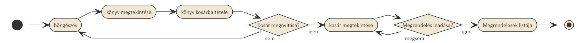
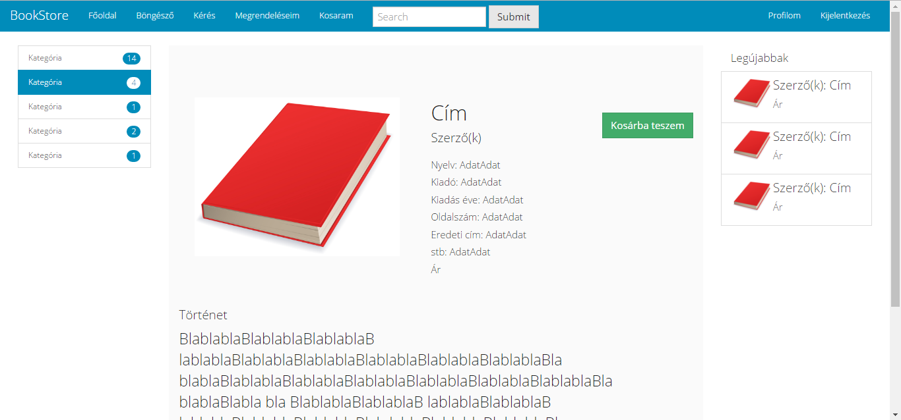
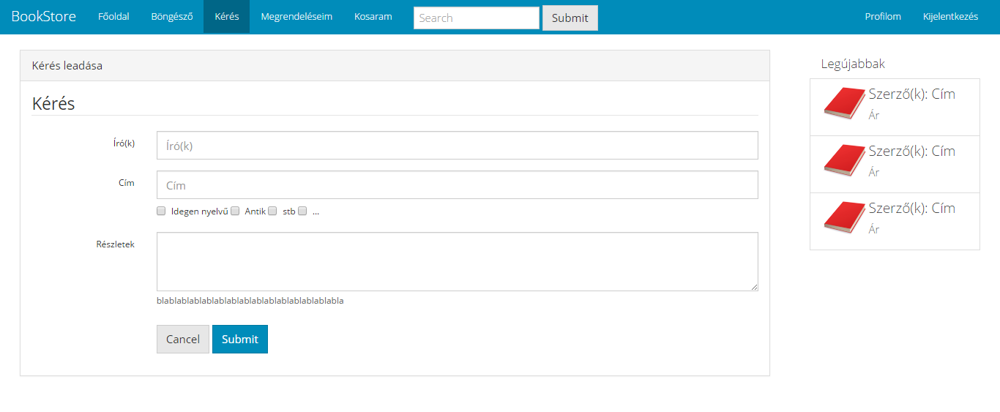

# bookStore
##1. Követelményanalízis

- Követelmények összegyűjtése

  - Funkcionális elvárások:
  
    + Vendégként szeretnék tudni regisztrálni.
    + Vendégként szeretnék az elérhető könyvek között böngészni.
    + Vendégként szeretnék a könyvek között keresni szerző vagy cím megadásával.
    + Vendégként szeretném az elérhető könyvek adatait megnézni.
    + Vendégként szeretném a legjobban keresett könyvek listáját megtekinteni a főoldalon.
    + Felhasználóként szeretnék tudni bejelentkezni.
    + Felhasználóként szeretnék tudni kijelentkezni.
    + Felhasználóként szeretném tudni szerkeszteni a saját profilomat.
    + Felhasználóként szeretnék tudni könyvet a kosárba tenni, kosárból kivenni.
    + Felhasználóként szeretnék tudni könyvre kérést leadni (raktárról el nem érhető, idegen nyelvű, meghatározott kiadású stb)
    + Felhasználóként szeretném a megrendeléseim, kéréseim listáját megtekinteni, 
    + Felhasználóként szeretnék tudni az aktív megrendelésekhez, kérésekhez kommentet fűzni
    + Adminként szeretném a felhasználók listáját megtekinteni
    + Adminként szeretném az aktuális megrendelések, kérések listáját megtekinteni, azokat szerkeszteni, törölni
    + Adminként szeretnék tudni új könyvet felvenni, meglévő könyvek adatait módosítani, könyvet törölni
    + Adminként szeretnék tudni új műfajt felvenni, meglévőket szerkeszteni, törölni
    
  - Nem funkcionális követelmények
  
    + Felhasználóbarát, ergonomikus elrendezés és kinézet
    + Gyors működés
    + Biztonságos működés: jelszavak tárolása, funkciókhoz való hozzáférés
    
- Szakterületi fogalomjegyzék

  - Könyv: Olyan, szövegből és ábrából álló, fizikai (papír) információhordozójú, nem periodikus (irodalmi vagy szakmai célú) publikáció, amely 49 vagy több oldalból áll, terjedelmi szempontból a borítót nem számítva. 
  A könyv nyomdaipari sokszorosítással előállított tömegtermék.
  
  - Műfajok
    + Disztópia: A disztópia egy társadalom víziója, mely ellentétes az utópiával. Gyakran negatív jövőképet mutat. A disztopikus társadalmakban gyakran az életkörülmények nyomorúságosak, a szenvedés, a szegénység, az elnyomás, az erőszak, járványok és szennyeződések jellemzik.
    + Fantasy: A Fantasy fő jellemzője, hogy a tartalma többnyire olyan elképzelt, mitikus jellegű, valamilyen tekintetben mindig irreális, az író által teremtett, csak annak fantáziájában létező alternatív világokba, mint keretbe van ágyazva, mely felépítésében, fizikai és etikai törvényeiben, értékeiben, élőlényeiben, rokonságot mutat a vallások és mítoszok által megteremtett képzeletbeli világokkal.
    + Horror: A horror olyan irodalmi műfaj, amelynek középpontjában a félelem áll. Habár alapvetően irodalmi művekről van szó, megjelenhet más ágazatokban is, melyek közül a legtipikusabb a film.
    + Krimi: A krimi vagy bűnügyi regény az epika (elbeszélő irodalom) egy népszerű tematikus műfaja, amely a bűntények felderítésével, elkövetésük bemutatásával, illetve lélektani indítóokaik vizsgálatával, valamint a bűnözők, nyomozók („detektívek”) és bűnügyi rendőrök világával foglalkozik.
    + Posztapokaliptikus: Egy látomásszerű világkép, melyben egy világméretű katasztrófa zajlott le és emiatt a világ megváltozott. Ez a katasztrófa utáni állapot legtöbbször negatív, baljós és sivár.
    + Romantikus: Olyan alkotások, amelyekben a felfokozott életérzés kifejezése, a reményvesztettség, a csalódás, a világfájdalom vagy éppen az ezzel ellentétes forradalmi hevület és lángoló életöröm van jelen.
    + Sci-fi: A sci-fi az angol science fiction kifejezés. Jelentése: tudományos-fantasztikus. A tudományos-fantasztikus mű olyan irodalmi alkotás, mely legtöbbször valódi vagy képzeletbeli tudományoknak a társadalomra, vagy egyes egyénekre gyakorolt hatását mutatja be. Ezeknek a műveknek a közös jellemzői, hogy zömében egy lehetséges jövőben játszódó képzeletbeli történetek.
    + Urban Fantasy: Hasonlít a történelmi fantasyhoz, de mai korban játszódik, ahol a mágia és/vagy a mitikus lények többé-kevésbé titokban jelen vannak.
	

- Használatieset-modell

  - Szerepkörök
    + Vendég: Raktáron lévő könyvek között böngészhet, megtekintheti azok adatait.
    + Felhasználó: A vendég szerepkörön túl könyveket kosárba helyezhet, megrendelést adhat le, raktárról nem elérhető, különleges könyvek felkutatására adhat le igényt, ezzel kapcsolatban a munkatársak megjegyzéseit megtekintheti, válaszolhat rájuk, saját megrendeléseit kilistázhatja.
    + Admin: A felhasználó szerepkörén túl új raktáron lévő könyvet vehet fel, a könyvek adatait módosíthatja, törölheti a raktáron lévő könyveket. Felhasználók, megrendelések listáját megtekintheti módosíthatja azokat. Megrendelésekhez kommentet fűzhet, állapotukat átállíthatja. Új műfajt vehet fel, meglévőt törölhet.
			
  - Használati esetek
    	
  - Folyamatok
  	+ felhasználó:
		- Bejelentkezés folyamata
			
		- Rendelés folyamata
			

##2. Tervezés

- Architektúra terv

	- Oldaltérkép
    
		- Publikus:
			- Főoldal
				+ Könyv adatainak megtekintése
			- Könyvek böngészése
				+ Könyv adatainak megtekintése
        + Keresés
			- Belépés
			- Regisztráció
		- Felhasználó:
			- Kilépés
			- Profiladatok
				+ Profiladatok szerkesztése
				+ Kérés felvitele
			- Könyvek böngészése
				+ Könyv adatainak megtekintése
					+ Könyv kosárba tétele
			- Kosár tartalmának listája
				+ Kosár tartalmának módosítása
				+ Megrendelés feladása
			- Megrendelések/kérések listája
				+ Megrendelés részletei
				+ Kommentek megtekintése
				+ Új komment
		- Admin:
			- Felhasználók listája
			- Megrendelések/kérések listája
				+ Megrendelés/kérés adatainak megtekintése
					+ Komment fűzése
				+ Megrendelés státuszának módosítása
				+ Megrendelés törlése
			- Könyvek listája
				+ Új könyv felvétele
				+ Könyv adatainak megtekintése
					+ Könyv adatainak szerkesztése
					+ Könyv törlése
	- Végpontok
		- GET /: főoldal
		- GET /book: könyvlista
		- GET /book/:id : könyv megtekintése
		- GET /bookList: könyvek listája admin számára
		- GET /book/:id/editBook: könyv szerkesztése, űrlap megjelenítése
		- POST /book/:id/editBook: könyv szerkesztése, adatok küldése
		- GET /book/:id/deleteBook: könyv törlése
		- GET /createBook: új könyv, űrlap megjelenítése
		- POST /createBook: új könyv, adatok küldése
		- GET /login: bejelentkező oldal
		- POST /login: bejelentkezési adatok felküldése
		- GET /logout: kijelentkezés
		- GET /signup: regisztrációs oldal
		- POST /signup: regisztrációs adatok felküldése
		- GET /profile: profiladatok
		- GET /profile/edit: profiladatok szerkesztése, ürlap megjelenítése
		- POST /profile/edit: profiladatok szerkesztése, adatok küldése
		- GET /orderList: megrendelések/kérések listája
		- GET /putInBasket/:id : könyv kosárba helyezése
		- GET /basket: kosár tartalma
		- GET /order: megrendelés leadása
		- GET /orderDetails/:id : megrendelés részletei
		- POST /doComment: megrendeléshez, kéréshez komment fűzése
		- GET /emptybasket: kosár tartalmának törlése
		- GET /deleteFromBasket/:id : törlés a kosárból
		- GET /newrequest: új kérés, ürlap megjelenítése
		- POST /newrequest: új kérés, adatok küldése
		- GET /editOrder/:id : megrendelés/kérés szerkesztése, űrlap megjelenítése
		- POST /editOrder/:id : megrendelés/kérés szerkesztése, adatok küldése
		- GET /editOrder/:id/delete: megrendelés törlése
		- GET /users: felhasználók listája
		- GET /book/category/:id : könyvek kategória szerinti szűrése
		- GET /categoryList: kategóriák listája
		- GET /createCategory: új kategória, űrlap megjelenítése
		- POST /createCategory: új kategória, adatok küldése
		- GET /categoryList/delete/:id : kategória törlése
		- GET /categoryList/edit/:id : kategória szerkesztése, űrlap megjelenítése
		- POST /categoryList/edit/:id : kategória szerkesztése, adatok küldése

- Felhasználóifelület-modell

	+ Oldalvázlatok
		- Főoldal
			
		- Regisztrációs oldal
			 
		- Bejelentkezés
			 
		- Böngészés
			 
		- Könyv adatlapja
			 
		- Kérési igény leadása
			 
		- Saját megrendelések listája
			 
    
- Osztálymodell

	+ Adatmodell
		- 
	+ Adatbázisterv
		- 
	+ Állapotdiagram
		- Rendelés
			- 
		- Kérés
			- 

##3. Implementáció

- Fejlesztői környezet bemutatása
  - Lokális fejlesztés Visual Studio Code és parancssor használatával
  - Keretrendszer: AdonisJS
    + Telepítés előtt git: protokoll átirányítása https: -re: git config --global url."https://".insteadOf git://
    + Keretrendszer telepítése npm i adonis-cli paranccsal
    + Új projekt létrehozása node_modules\.bin\adonis new bookStore paranccsal
    + cd bookStore
    + Package.json fájlban a --harmony-proxies törlése
    + Indítás npm start vagy npm run dev paranccsal lehetséges
  - 
- Könyvtárstruktúrában lévő mappák funkciójának bemutatása
  - bookStore
    - app
      + Http
        - Controllers
          + BookController.js
          + CategoryController.js
          + OrderController.js
          + UserController.js
        - routes.js
      + Model
        - Book.js
        - Category.js
        - Comment.js
        - Order.js
        - Token.js
        - User.js
    - config
    - database
      + migrations
      + seeds
    - public
    - resources
      + view
        - basket.njk
        - book.njk
        - bookList.njk
        - categoryList.njk
        - createBook.njk
        - createCategory.njk
        - editBook.njk
        - editCategory.njk
        - editOrder.njk
        - editProfile.njk
        - explore.njk
        - logIn.njk
        - master.njk
        - newRequest.njk
        - orderDetails.njk
        - orderList.njk
        - profile.njk
        - signUp.njk
        - userList.njk
        - welcome.njk
    - .env
    - package.json
    - README.md
    - server.js
      
##4. Felhasználói dokumentáció

- A futtatáshoz ajánlott hardver-, szoftver konfiguráció
  - Futtatáshoz szükséges operációs rendszer: Tetszőleges operációs rendszer
  - A futtatáshoz szükséges hardver: Operációs rendszerek szerint megadva
  - Egyéb követelmények: Internet böngésző telepítése, JavaScript ajánlott

- Telepítés lépései: hogyan kerül a Githubról a célgépre a program, hogyan kell elindítani
  - Telepítés
    - Kód letöltése
    - git config --global url."https://".insteadOf git:// (csak a géptermekben)
    - npm install
    - .env.example fájl átnevezése .env-re
    - npm run dev paranccsal futtatni
    - localhost:3333 megnyitása
    
  - Express-admin adatbázis-kliens futtatása
    - node_modules\.bin\admin config/express-admin
    - Első futtatáskor a paraméterek beállítása
      + a. sqlite adatbázis
      + b. 4444-es port pl.
      + c. username és password beállítása
    - localhost:4444 megnyitása

- A program használata
  ####1. Böngészőben főoldal megnyitása
  ####2. Jobb felső sarokban Regisztráció vagy Bejelentkezés feliratra kattintva tudunk bejelentkezni vagy regisztrálni. Lehetőség van adminként bejelentkezni admin@admin.hu e-mail címmel és admin jelszóval.
  ####3. Bejelentkezést követően a saját profilunkat tekinthetjük meg. Profil szerkesztése gombra kattintva szerkeszthetjük azt, Special request gombra kattintva új kérést adhatunk le. Mindkét esetben egy-egy űrlapra jutunk, ahol a kívánt adatokat kitölthetjük, hibás adatok esetén az űrlap jelzi a hibát.
  ####4. Bejelentkezés után a jobb felső sarokban a Kosaram és a Megrendelések, Profil, Kijelentkezés, illetve admin felhasználó esetén a Műfajok, Felhasználók, és Könyvek felaratok is megjelennek
  ####5. Kosaram feliratra kattintva megtekinthető a kosárba helyezett könyvek, azokat törölni lehet a listáról, illetve a Kosár üritése gombbal az összes könyv törölhető a listáról. A megrendelés leadásához a Rendelés leadása gombra kell kattintani. 
  ####6. A Megrendelések feliratra kattintva az egyszerű felhasználó a saját korábbi megrendeléseinek listáját tekintheti meg, az admin pedig az összes korábban leadott megrendelést láthatja.
  ####7. Egy megrendelés sorára kattintva a megrendelés részletei tekinthetőek meg. Itt láthatjuk a megrendelt könyvek listáját(azokra kattintva a könyv adatlapját), a korábbi kommenteket, illetve új kommentet adhatunk, ha a megrendelés még nincs lezárva.
  ####8. Admin felhasználó a megrendelések listájában az adott megrendeléshez tartozó sorban a Módosítás feliratra kattintva állíthatja a megrendelés állapotát a megjelenő űrlap kitöltésével, és Megrendelés törlése feliratra kattintva törölheti azt
  ####9. Admin felhasználó a menüsorban a Műfajok feliratra kattintva kilistázza a létező műfajokat, azokat szerkesztheti illetve törölheti(Szerkesztés, Törlés feliratok), és az Új műfaj feliratú gombra kattintva új műfajt vehet fel
  ####10. Az admin a menüsorban a Felhasználók feliratra kattintva kilistázhatja a regisztrált felhasználókat, a Könyvek feliratra kattintva pedig a könyveket. Új könyv feliratú gombra kattintva új könyvet vehet fel a megjelenő űrlap értelemszerű kitöltése után. Hibás adat esetén az űrlap jelez.
  ####11. A könyvek listájában egy könyv sorára kattintva a könyv adatlapja jelenik meg, ahol ha az adott könyv raktáron található, akkor a kosárba helyezhető, az admin a Törlés gombbal törölheti a könyvet, a Könyv szerkesztése gombbal pedig szerkesztheti annak adatait.
  ####12. A menüsor bal oldalán a Böngésző feliratra kattintva először az összes könyv listázódik ki. A képernyő bal oldalán a műfajok listája jelenik meg, ezek közül az egyikre kattintva az adott műfajra szűrhetjük a könyveket. A menüsor alatt középena keresőbe beírva a könyvek címében és írójának nevében kereshetünk.
  
##5. Fejlesztések

- Törlés
  - érintett fájlok
    - kliens: delete.js
    - szerver: BookController.js, CategoryController.js, OrderController.js, 
  - funkció működése
    - Műfaj törlése:
      - A "CategoryDelete" osztályba tartozó gombra való kattintás hatására meghívódik az onDeleteCategoryClick függvény.
      - A függvény először megállítja az elemhez kapcsolódó alapértelmezett műveletet, majd meghívja a my_confirm() függvényt, amely létrehozza a megerősító ablakot (ConfirmModal objektum). Ennek először a konstruktora hívódik meg, majd lekezeljük a felhasználó döntését. Ha az Ok gombra kattint, akkor true-val, különben false-al tér vissza.
      - Ha a felhasználó az Ok gombra kattiontott, azaz megerősítette törlési szándékát, akkor meghívjuk az ajaxDeleteCategory() függvényt, aminek egy paramétere van, az url, ami a gomb lenyomásakkor meghívódott. Az ajaxDeleteCategory() kérést küld a servernek. A routes.js fájlban adjuk meg, hogy ha a gombhoz tartozó link ajax prefixel jelenik meg, akkor a CategoryControllernek az ajaxDelete függvénye hívódjon meg. Ez hasonlóan műkdik, mint a deleteCategory függvény.
      - Ha a kérésre helyes a válasz (ok), akkor visszalépünk a kategóriák listájának oldalára.
    - Könyv, megrendelés törlése, illetve a kosárból való törlés, és a kosár kiürítése hasonló módon történik.
  
- Keresés
  - érintett fájlok
    - kliens: main.js
    - szerver: CategoryController.js
  - funkció működése
    - A kereső mezőbe való gépelés esetén az onSearch függvény hívódik meg.
    - Itt először megvizsgáljuk, hogy a keresőmező nem üres-e, ha nem, akkor meghívódik az ajaxSearch függvény, melynek paramétere a keresőmező tartalma (text). Kérést küldünk a szerver felé, melynek url-je ajax/search, adata pedig a text.
    - A szerveren a CategoryController ajaxSearch függvénye hívódik meg. Ez megkeresi azokat a könyveket, melyeknek a szerzőjére vagy címére illeszkedik a keresőmező tartalma, ezt küldi vissza, az oldalon pedig ezek kilistázódnak.
  
- Műfaj könyvhöz hozzáadása/elvétele
  - érintett fájlok
    - kliens: smart_categories.js
    - szerver: BookController.js
  - funkció működése
    - Hozzáadás gombot szúrunk be, ha az ürlap műfaj törlésére alkalmas mezőt is tartalmaz, akkor ahhoz is beszúr egy hozzáadás gombot.
    - Mindkét esetben meghívódik az insertCategory függvény. Az első paramétere azt adja meg, hogy műfaj hozzáadására, vagy eltávolítására alkalmas listához akaronk további műfajt hozzáadni, a második pedig azt, hogy mi elé akarunk beszúrni.
    - Submit eseménykor összeállítjuk a hozzáadandó, és a törlendő műfajok listáját. Az ajaxSubmit függvény meghívódik, kérést küldünk a szervernek.
  
- Bejelentkezés
  - érintett fájlok
    - kliens: popup_login.js
    - szerver: UserController.js
  - funkció működése
    - Bejelentkezés gombra kattintva modális dialógusablakot (modal) hozunk létre
    - A modális ablakba betöltjük a bejelentkező oldalt (formContainer.load()), majd megjelenítjük a dialógusablakot ($modal.modal('show'))
    - Submit gombra feliratkozunk
    - Az /ajax/logIn végpontra elküldjük az ürlap tartalmát. Sikeres bejelentkezés esetén a profil oldalra lépünk.

- Validáció
  - érintett fájlok
    - kliens: createBook.njk, createCategory.njk, editBook.njk, editCategory.njk, newRequest.njk, signUp.njk
    - szerver: 
  - funkció működése
    - Bootstrap Validator segítségével. 
  
##6. Tesztelés

- Tesztesetek
  - Felhasználó létrehozása
  - Bejelentkezés
  - Könyv kosárba tétele
  - Kosárból egy elem törlése
  - Kosár ürítése
  - Megrendelés leadása
  - Megrendelés részleteinek megtekintése
  - Megrendeléshez komment fűzése
  - Profil szerkesztése
  - Kijelentkezés
  - Új könyv felvétele
  - Könyv szerkesztése
  - Könyv törlése
  - Műfaj hozzáadása
  - Műfaj szerkesztése
  - Műfaj törlése
  - Megrendelés állapotának szerkesztése
- Tesztelési környezet
  - Funkcionális tesztelést végzünk, melyhez Selenium-ot használunk, mely a Firefox egy bővítménye, csak ezzel a böngészővel használható. A https://addons.mozilla.org/hu/firefox/addon/selenium-ide/ oldalról tölthető le. Telepítés után böngésző eszköztárában megjelenik a bővítmény ikonka. Erre kattintva nyitható meg. Teszt Ctrl+o lenyomása után a futtatandó teszt kiválasztásával indítható el. A teszt indítása előtt érdemes a sebességet lentebb venni, amit az eszköztárnak a csúszkás elemével lehet megtenni. A teszt indítása az eszköztárnak balról a második ikonjával indítható el (Play current test case)
